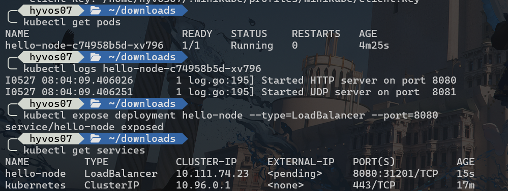
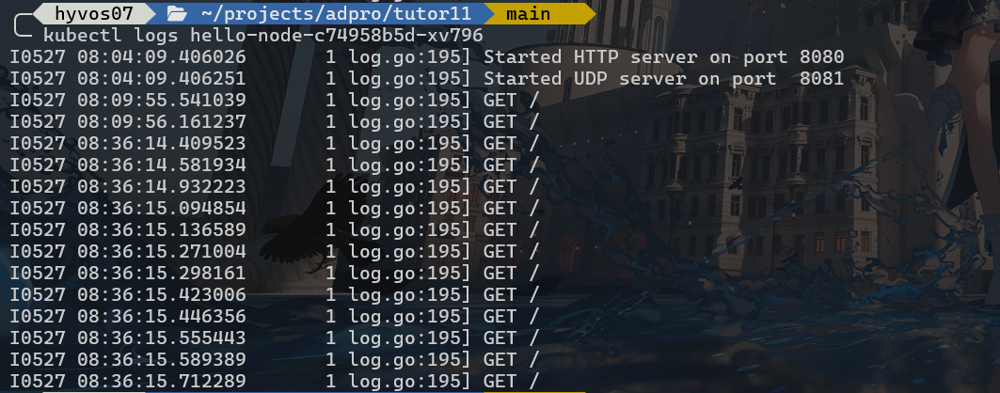

# 🦀 Advanced Programming - Deployment on Kubernetes

**Nama**  : Daniel Liman  
**NPM**   : 2306220753  
**Kelas** : Pemrograman Lanjut A

## Reflection - Hello Minikube 👋

### Compare the application logs before and after you exposed it as a Service. Try to open the app several times while the proxy into the Service is running. What do you see in the logs? Does the number of logs increase each time you open the app?

Berikut adalah log yang saya dapat pada saat menjalankan `kubectl logs <nama-pods>` dalam keadaan belum di-expose ke service.

<picture>
    
</picture>

Pada hasil tangkapan layar di atas, dapat dilihat bahwa logs yang keluar dari perintah tersebut masih berupa log internal di dalam container saja. Log ini keluar dari hasil deployment dan pembuatan pods yang berhasil dijalankan.

Setelah deployment di-expose ke service yang ditentukan (pada kasus ini **Load Balancer**), barulah aplikasi dapat diakses dari luar dan menerima request yang saya lakukan dengan mengakses link service minikube (yang didapat dari menjalankan `minikube service hello-node --url`).

<picture>
    
</picture>

Dapat dilihat bahwa setelah saya mencoba beberapa kali mengakses link service yang dibuat oleh minikube, muncul logs baru berupa detail request yang dikirim (dalam kasus ini `GET` karena hanya mengakses link deployment di browser) muncul. Tentu saja setiap kali aplikasi dibuka, maka jumlah logs request akan bertambah.

### Notice that there are two versions of `kubectl get` invocation during this tutorial section. The first does not have any option, while the latter has `-n` option with value set to `kube-system`. What is the purpose of the `-n` option and why did the output not list the pods/services that you explicitly created?

Command `kubectl get` memiliki flag option `-n` yang berfungsi untuk mendefinisikan **namespace** yang kita tuju di kubernetes. Pada saat memanggil `kubectl get` tanpa memakai flag `-n`, kubectl secara otomatis memakai namespace `default`, dimana namespace ini adalah tempat pods dan service yang di-expose sebelumnya. Secara 'default', pods dan service yang berhasil di-deploy akan berada di namespace ini.

Sedangkan itu, perintah `kubectl get` yang memakai opsi flag `-n kube-system` berarti menampilkan pods dan service yang berada di namespace dengan nama **kube-system**. Namespace ini berisi pods dan service di level sistem dari kubernetes, dimana mereka adalah service-service yang mengurus infrastruktur dan service-service yang diperlukan oleh sebuah cluster kubernetes untuk berjalan.