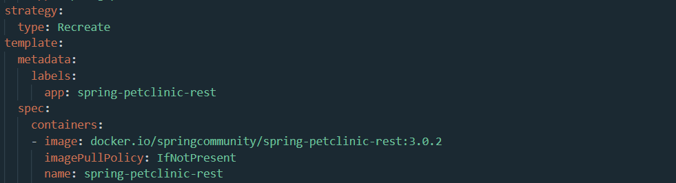
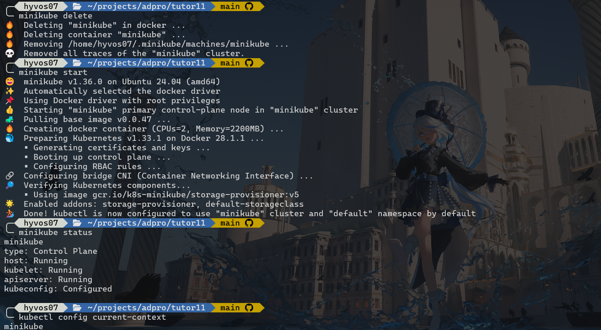
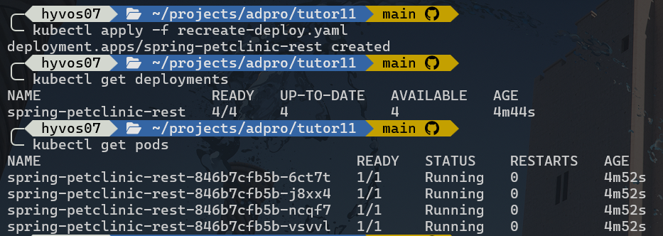
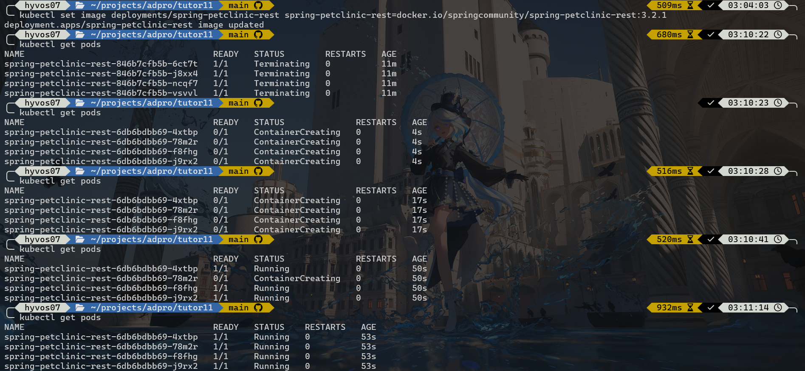
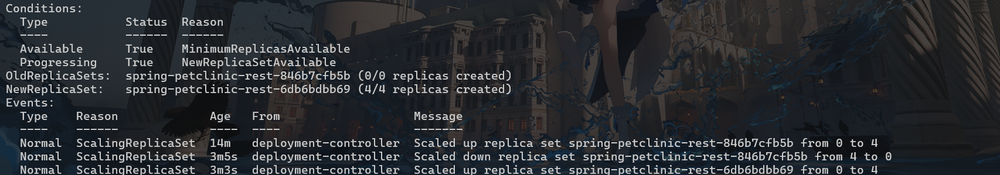

# 🦀 Advanced Programming - Deployment on Kubernetes

**Nama**  : Daniel Liman <br>
**NPM**   : 2306220753 <br>
**Kelas** : Pemrograman Lanjut A


## Reflection - Hello Minikube 👋

### *Compare the application logs before and after you exposed it as a Service. Try to open the app several times while the proxy into the Service is running. What do you see in the logs? Does the number of logs increase each time you open the app?*

Berikut adalah log yang saya dapat pada saat menjalankan `kubectl logs <nama-pods>` dalam keadaan belum di-expose ke service.

<picture>
    
</picture>

Pada hasil tangkapan layar di atas, dapat dilihat bahwa logs yang keluar dari perintah tersebut masih berupa log internal di dalam container saja. Log ini keluar dari hasil deployment dan pembuatan pods yang berhasil dijalankan.

Setelah deployment di-expose ke service yang ditentukan (pada kasus ini **Load Balancer**), barulah aplikasi dapat diakses dari luar dan menerima request yang saya lakukan dengan mengakses link service minikube (yang didapat dari menjalankan `minikube service hello-node --url`).

<picture>
    
</picture>

Dapat dilihat bahwa setelah saya mencoba beberapa kali mengakses link service yang dibuat oleh minikube, muncul logs baru berupa detail request yang dikirim (dalam kasus ini `GET` karena hanya mengakses link deployment di browser) muncul. Tentu saja setiap kali aplikasi dibuka, maka jumlah logs request akan bertambah.

### *Notice that there are two versions of `kubectl get` invocation during this tutorial section. The first does not have any option, while the latter has `-n` option with value set to `kube-system`. What is the purpose of the `-n` option and why did the output not list the pods/services that you explicitly created?*

Command `kubectl get` memiliki flag option `-n` yang berfungsi untuk mendefinisikan **namespace** yang kita tuju di kubernetes. Pada saat memanggil `kubectl get` tanpa memakai flag `-n`, kubectl secara otomatis memakai namespace `default`, dimana namespace ini adalah tempat pods dan service yang di-expose sebelumnya. Secara 'default', pods dan service yang berhasil di-deploy akan berada di namespace ini.

Sedangkan itu, perintah `kubectl get` yang memakai opsi flag `-n kube-system` berarti menampilkan pods dan service yang berada di namespace dengan nama **kube-system**. Namespace ini berisi pods dan service di level sistem dari kubernetes, dimana mereka adalah service-service yang mengurus infrastruktur dan service-service yang diperlukan oleh sebuah cluster kubernetes untuk berjalan.


## Reflection - Rolling Update & Kubernetes Manifest File

### *What is the difference between Rolling Update and Recreate deployment strategy?*

**Rolling Update** adalah strategi deployment default dari Kubernetes, dimana setiap kali terjadi update Kubernetes akan membuat pods baru (sambil mempertahankan pods yang lama) yang berisi aplikasi yang paling terbaru di cluster sekarang. Setelah pods baru berhasil terbentuk & berjalan, barulah pods lama yang masih memiliki versi lama dari aplikasi akan di-terminate, digantikan oleh versi yang terbaru di pods yang baru saja dibuat.

Sedangkan itu, **Recreate Deployment** adalah strategi deployment yang akan meng-terminate semua pods yang ada sekarang (tanpa ada sisa) saat update terbaru dijalankan. Setelah dimatikan, barulah pods baru yang berisi versi terbaru dari aplikasi akan dibuat dan dijalankan. Berbeda dengan Rolling Update, tentu saja dampak dari mematikan semua pods yang tersedia di aplikasi akan membuat aplikasi secara real-time akan down untuk sementara, sampai pods baru yang berisi versi terbaru berhasil dibuat dan dijalankan di dalam cluster Kubernetes.


### *Try deploying the Spring Petclinic REST using Recreate deployment strategy and document your attempt.*

Berikut dokumentasi dalam langkah-langkah untuk membuat deployment aplikasi Spring Petclinic REST menggunakan Recreate Deplyment strategy.

#### 1. Membuat file manifest deployment

Untuk mempermudah konfigurasi, saya akan memakai kembali [`deployment.yaml`](deployment.yaml) dan membuat modifikasi dari isi file tersebut dan menaruhnya di file [`recreate-deploy.yaml`](recreate-deploy.yaml).

Pertama, saya akan mengubah isi dari field `type` dari strategy yang akan digunakan, yaitu dengan value **Recreate**. Ini menandakan bahwa deployment akan memakai strategy Recreate Deployment. Selain itu, saya juga harus menghapus field `rollingUpdate` dan isinya yang masih ada di bagian strategy, agar tidak menyebabkan konflik pada saat dpeloyment dijalankan.

```yaml
strategy:
  type: Recreate
  # Hapus field rollingUpdate
```

Untuk bisa memeriksa hasil dari strategy deployment, saya juga mengubah versi aplikasi dari `3.2.1` menjadi `3.0.2`.

```yaml
spec:
  containers:
  - image: docker.io/springcommunity/spring-petclinic-rest:3.0.2  # 3.2.1 --> 3.0.2
    imagePullPolicy: IfNotPresent
    name: spring-petclinic-rest
```

Berikut hasil dari (sebagian) file `recreate-deploy.yaml` jika sudah diubah sesuai dengan arahan yang ada di atas.
<picture>
    
</picture>


#### 2. Menjalankan Session Minikube Baru

Untuk memastikan cluster Kubernetes benar-benar fresh dan tidak terpengaruh oleh deployment yang dilakukan sebelumnya (dengan strategy Rolling Update), perlu dijalankan command-command berikut.

- Delete instance minikube yang ada sekarang.
    
    ```shell
    minikube delete
    ```

- Re-init minikube dengan ambil image docker lagi dari minikube.

    ```shell
    minikube start
    ```

- Memeriksa status cluster yang baru saja diambil, ensure jika kubectl mengurus cluster untuk minikube sekarang.

    ```shell
    minikube status
    kubectl config current-context
    ```




#### 3. Melakukan Deployment Pertama Kali

Setelah selesai mengonfigurasi file yaml dan minikube, saya menjalankan command berikut untuk memulai deployment Petclinic yang sudah saya rancang sebelumnya.
```shell
kubectl apply -f recreate-deploy.yaml
```


Dapat dilihat bahwa deployment berhasil dijalankan.


#### 4. Update Deployment

Sekarang saya akan mencoba untuk melakukan update ke versi `3.2.1` seperti yang ada di tutorial. Saya akan melihat bagaimana strategy Recreate deployment bekerja. Upgrade bisa dilakukan dengan menjalankan command berikut.
```shell
kubectl set image deployments/spring-petclinic-rest spring-petclinic-rest=docker.io/springcommunity/spring-petclinic-rest:3.2.1 
```

Setelah dijalankan, jalankan `kubectl get pods` selama proses build secara berkala dan command `kubectl describe deployments spring-petclinic-rest` untuk melihat history dari deployment.





Dapat ditinjau pada histori deployment dan pengecekan pods secara berkala, bahwa setelah update diperintahkan di atas pods yang sebelumnya dibuat langsung dimatikan semua tanpa menyisakan pods yang bisa diakses selama masa/proses updating. Tentunya hal ini akan membuat aplikasi sementara tidak dapat diakses terlebih dahulu.


### *Prepare different manifest files for executing Recreate deployment strategy.*

File hasil deployment tadi bisa didapat dengan menjalankan command berikut.
```shell
kubectl get deployments/spring-petclinic-rest -o yaml > recreate-config.yaml
```

### *What do you think are the benefits of using Kubernetes manifest files? Recall your experience in deploying the app manually and compare it to your experience when deploying the same app by applying the manifest files (i.e., invoking `kubectl apply -f` command) to the cluster*

Menggunakan file manifest di Kubernetes memberikan pendekatan yang lebih deklaratif dalam pengelolaan deployment dari aplikasi kita. Daripada menjalankan perintah satu per satu untuk membuat Pod, Service, atau Deployment secara terpisah, dengan file manifest kita hanya perlu menulis konfigurasi lengkap aplikasi dalam satu atau beberapa file YAML. Saat file ini dijalankan dengan perintah `kubectl apply -f <file_name>`, Kubernetes akan langsung membaca dan menyesuaikan keadaan cluster agar sesuai dengan spesifikasi tersebut. Dengan file manifest, proses deployment juga menjadi lebih dapat diulang (reproducible), karena kita bisa menerapkannya kembali di cluster lain tanpa harus mengingat langkah-langkah manual.